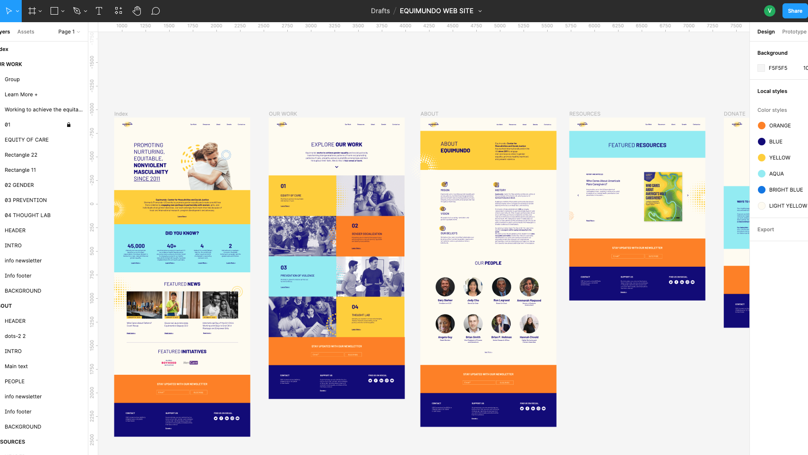

<h1>¡Hola!</h1>

Les presento mi 2º proyecto desarrollado íntegramente por mí.
Se trata de una ONG de Estados Unidos que trabaja para promover la igualdad de género.

Desarrollé tanto el diseño gráfico integral del sitio web como el maquetado y la subida al servidor.

HERRAMIENTAS Y LENGUAJES UTILIZADOS:

› ✍🏻 LÁPIZ Y PAPEL 😀 
› 👩‍🎨 FIGMA 
› 👩🏼‍💻 VISUAL STUDIO CODE 
› <> HTML 
› <> CSS  
› BOOTSTRAP 
› https://animate.style/

VER EN:
https://equimundo.netlify.app/

